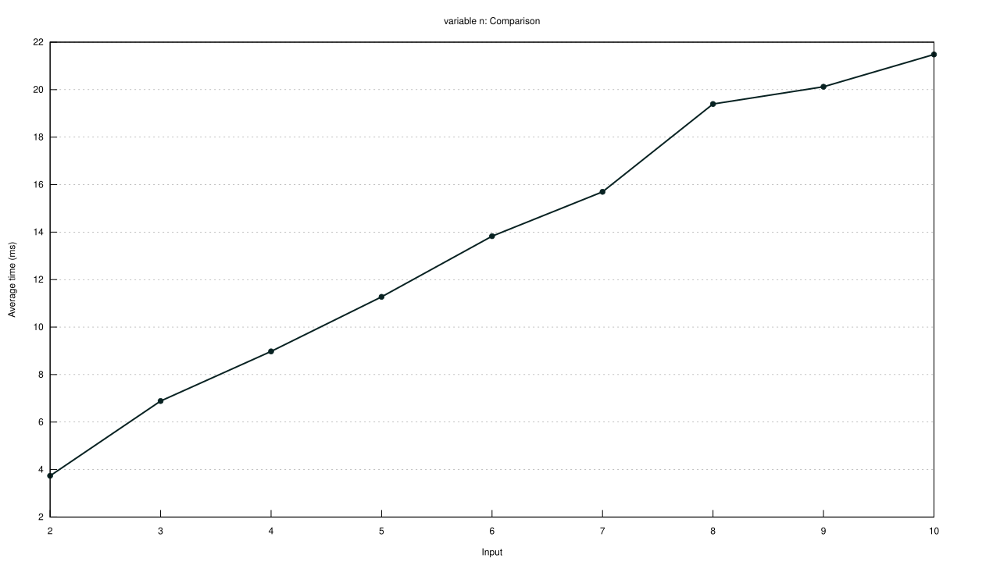
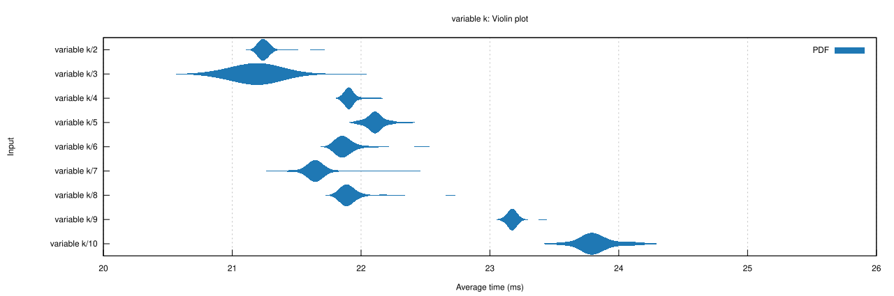

# LCS_RS
This project is a rust implementation of a solution to the following problem:


Given $N$ binary files of combined total length $L$, find the longest common binary subsequence which is present in at least $K$ of those files.

This implementation uses a suffix array construction algorithm based on that in [rust-bio](https://github.com/rust-bio/rust-bio), 
as well as several ideas from the algorithm presented in [^fn1].

### Usage
Clone the repo, and run `cargo build --release` in order to build an optimized binary.

Example usage: 
```
$ lcs_rs -k 2 file_1 file_2 file_3 file_4
LCS found with length 27648
-> in sample.2 at 3072
-> in sample.3 at 17408
```

### Benchmarks

Varying the total number of files:

| Command | Mean [ms] | Min [ms] | Max [ms]|
|:----------------------------------------|-------:|--------:|--------:|
| `lcs_rs -k 2 sample.1 ... sample.2`  | 3.7359 |  3.7367 |  3.7374 |                           
| `lcs_rs -k 2 sample.1 ... sample.3`  | 6.8810 |  6.8864 |  6.8938 |                          
| `lcs_rs -k 2 sample.1 ... sample.4`  | 8.9721 |  8.9764 |  8.9806 |                          
| `lcs_rs -k 2 sample.1 ... sample.5`  | 11.269 |  11.274 |  11.279 |                          
| `lcs_rs -k 2 sample.1 ... sample.6`  | 13.757 |  13.829 |  13.924 |                          
| `lcs_rs -k 2 sample.1 ... sample.7`  | 15.674 |  15.697 |  15.721 |                          
| `lcs_rs -k 2 sample.1 ... sample.8`  | 19.345 |  19.395 |  19.455 |                          
| `lcs_rs -k 2 sample.1 ... sample.9`  | 20.054 |  20.121 |  20.203 |                          
| `lcs_rs -k 2 sample.1 ... sample.10` | 21.471 |  21.482 |  21.494 | 

Scaling for $n$: 



Varying the minimum number of files the common substring must be in:

| Command | Mean [ms] | Min [ms] | Max [ms]|
|:----------------------------------------|-------:|--------:|--------:|
| `lcs_rs -k 2 sample.1 ... sample.10`    | 21.245 |  21.258 |  21.274 |                          
| `lcs_rs -k 3 sample.1 ... sample.10`    | 21.172 |  21.232 |  21.327 |                          
| `lcs_rs -k 4 sample.1 ... sample.10`    | 21.910 |  21.921 |  21.934 |                          
| `lcs_rs -k 5 sample.1 ... sample.10`    | 22.102 |  22.117 |  22.133 |                          
| `lcs_rs -k 6 sample.1 ... sample.10`    | 21.869 |  21.889 |  21.913 |                          
| `lcs_rs -k 7 sample.1 ... sample.10`    | 21.637 |  21.660 |  21.686 |                          
| `lcs_rs -k 8 sample.1 ... sample.10`    | 21.903 |  21.923 |  21.947 |                          
| `lcs_rs -k 9 sample.1 ... sample.10`    | 23.170 |  23.180 |  23.192 |                          
| `lcs_rs -k 10 sample.1 ... sample.10`   | 23.802 |  23.833 |  23.866 |                           

Violin Plot for $k$: 



Which is nicely clustered around 20-23ms

We see very linear scaling with each! $\mathcal{O}(n)$ acheived!

### Notes on implementation

The basic structure of this implementation is as follows:

1. Read in all files as `u8` bytes
2. Increment all bytes by 1 into `u16`s to make room for a "sentinel", `0u16`.
3. Append all files terminated with the sentinel
4. Use the custom `u16` implementation of [SAIS](https://zork.net/~st/jottings/sais.html) to construct the suffix array from the combined files
5. Build the Longest Common Prefix array
6. Scan across the suffix array for subsequences which are present in at least $K$ of the files
7. Compute the minimum LCP for all prefixes in those subseqences
8. Find the subsequence with the maximum min LCP
9. Determine and return the resulting files present in that subsequence of the suffix array with their offsets

This is the first thing I've ever written in rust, so the code may be a little sloppy! 
Feel free to make an issue if something could be written in a better way. 

##### References
[^fn1]: Babenko M.A., Starikovskaya T.A. (2008) Computing Longest Common Substrings Via Suffix Arrays. In: Hirsch E.A., Razborov A.A., Semenov A., Slissenko A. (eds) Computer Science – Theory and Applications. CSR 2008. Lecture Notes in Computer Science, vol 5010. Springer, Berlin, Heidelberg
